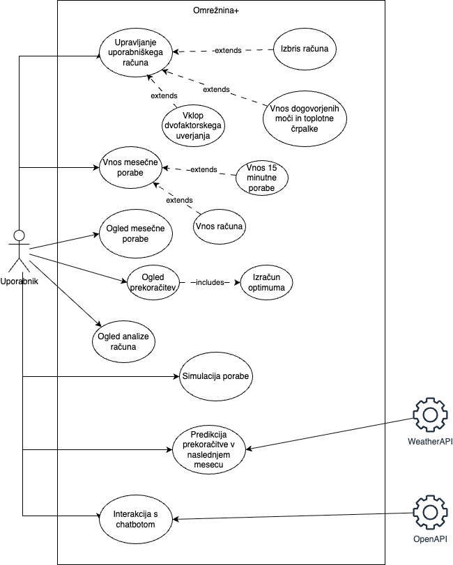

# ⚡ Omrežnina+

[🌐 Dostop do aplikacije](https://omreznina.netlify.app/)  
[📘 Dokumentacija (GitBook)](https://omreznina.gitbook.io/omreznina+)  
[💻 GitHub repozitorij](https://github.com/adam8kac/Omreznina)  
[🎫 Upravljanje nalog (YouTrack)](https://omreznina.youtrack.cloud/issues)

---

## 📖 O projektu

**Omrežnina+** je sodobna spletna aplikacija, ki uporabnikom omogoča napreden nadzor nad porabo električne energije in optimizacijo stroškov. Glavni cilji aplikacije so:

- omogočiti celovit pregled nad mesečno in dnevno porabo,
- prikazovati stroške glede na časovne bloke in dogovorjeno moč,
- zaznavati in prikazovati prekoračitve ter izračunavati posledične stroške,
- omogočiti simulacijo optimalne moči in prikaz prihrankov,
- zagotoviti večjo varnost z uporabo MFA (dvofaktorske avtentikacije),
- avtomatsko analizirati naložene podatke iz sistema mojelektro.si,
- prikazati podatke tudi za sončne elektrarne.

Aplikacija je primerna tako za gospodinjstva kot manjša podjetja, ki želijo izboljšati učinkovitost porabe električne energije in zmanjšati stroške.

---

## 🏗️ Arhitektura sistema

Aplikacija je zgrajena po sodobni modularni arhitekturi z jasno ločitvijo med frontendom, backendom in podatkovno plastjo. Uporabljene so naslednje tehnologije:

- **Frontend**: React + Vite + TailwindCSS
- **Backend**: Spring Boot (Java), z uporabo Firebase SDK in AES enkripcije
- **Podatkovna baza**: Firebase Firestore (NoSQL)
- **Avtentikacija**: Firebase Auth z razširitvijo za TOTP MFA (Google Authenticator)
- **CI/CD**: GitHub Actions za avtomatsko gradnjo in testiranje, Netlify za frontend in Render za backend
- **Zunanje integracije**: OpenWeather, OpenAI za dinamične povzetke in analitiko


---

## 🗃️ Shema Firestore baze

Podatki so strukturirani po uporabnikih (`uid`), vsak uporabnik ima shranjene naslednje podkategorije:

- `poraba/{mesec}/{dan}` – dejanska poraba, prejeta in oddana energija, sončna energija
- `prekoracitve/{leto}/{mesec}/{blok}` – beležene prekoračitve moči in pripadajoči stroški
- `racuni/{fileName}` – ročno vneseni računi uporabnika (CSV ali ročni vnos)
- `mfaSettings` – podatek o vklopljenem MFA in AES-enkriptirani TOTP skrivnosti


---

## 🎯 UML UseCase diagram

Diagram zajema naslednje funkcionalnosti:

- registracija uporabnika,
- prijava z ali brez MFA zaščite,
- upravljanje uporabniškega računa,
- vnos porabe ročno ali iz datotek,
- ogled grafov in analiz,
- simulacija optimalne porabe in primerjava stroškov,
- generiranje povzetkov in priporočil.



---

## 🚀 Deployment (CI/CD)

Projekt uporablja GitHub Actions za avtomatizacijo:

- ✅ gradnja in testiranje React + Spring Boot projektov,
- ✅ deploy frontenda na Netlify,
- ✅ deploy backenda na Render,
- ✅ analiza kode z uporabo SonarCloud,
- ✅ podpora za Docker CI/CD.

Frontend je hostan na https://omreznina.netlify.app  
Backend teče na Render in komunicira z Firestore bazo v realnem času.

---

## ⚙️ Lokalna vzpostavitev

### 1. Kloniranje repozitorija

```bash
git clone https://github.com/adam8kac/Omreznina.git
cd Omreznina
```

### 2. Zagon frontenda

```bash
cd frontend
npm install
npm run dev
```
Frontend bo dostopen na http://localhost:5173

### 3. Zagon backenda
```bash
cd backend
mvn spring-boot:run
```

Pred tem konfiguriraj datoteko application.properties s Firebase Admin JSON datoteko (GOOGLE_APPLICATION_CREDENTIALS).
Za lokalni razvoj se običajno nastavi okolje s potjo do .json datoteke:

```bash
export GOOGLE_APPLICATION_CREDENTIALS=path/to/your/firebase-adminsdk.json
```

Backend bo dostopen na:
http://localhost:8080

### 4. Alternativno (Docker)
```bash
docker build -t omreznina-backend .
docker run -p 8080:8080 omreznina-backend
```

---

### 🧪 Testiranje

✅ Cypress: e2e testi (prijava, MFA, grafi, simulacije)

✅ JUnit & Mockito: unit testi v Spring Boot

✅ SonarCloud: analiza kode in pokritost s testi

✅ CI/CD: vsi testi tečejo v GitHub Actions

---

### 🔐 MFA zaščita
Uporabniki lahko omogočijo MFA (TOTP) z uporabo Google Authenticator. Skrivnost se AES-enkriptira in shrani v Firestore. MFA se preverja ob prijavi, če je aktivirana.

Firebase TOTP MFA

Google Identity MFA

---

### 🌐 Uporabljena orodja in dokumentacija

| Orodje                   | Dokumentacija                                                                                                                                       |
| ------------------------ | --------------------------------------------------------------------------------------------------------------------------------------------------- |
| Firebase Firestore       | [firebase.google.com/docs/firestore](https://firebase.google.com/docs/firestore)                                                                    |
| Firebase TOTP MFA        | [firebase.google.com/docs/auth/web/totp-mfa](https://firebase.google.com/docs/auth/web/totp-mfa)                                                    |
| Google Identity MFA      | [cloud.google.com/identity-platform/docs/web/mfa](https://cloud.google.com/identity-platform/docs/web/mfa)                                          |
| OpenWeather API          | [openweathermap.org/api/one-call-3](https://openweathermap.org/api/one-call-3)                                                                      |
| Netlify                  | [docs.netlify.com](https://docs.netlify.com/)                                                                                                       |
| Render                   | [render.com/docs](https://render.com/docs)                                                                                                          |
| OpenAI                   | [platform.openai.com/docs/overview](https://platform.openai.com/docs/overview)                                                                      |
| Docker                   | [docs.docker.com/get-started/introduction/build-and-push-first-image](https://docs.docker.com/get-started/introduction/build-and-push-first-image/) |
| Docker + GitHub Actions  | [docs.docker.com/build/ci/github-actions](https://docs.docker.com/build/ci/github-actions/)                                                         |
| Cypress                  | [docs.cypress.io](https://docs.cypress.io/app/get-started/why-cypress)                                                                              |
| SonarCloud               | [docs.sonarsource.com](http://docs.sonarsource.com/sonarqube-cloud/)                                                                                |
| Spring Boot              | [docs.spring.io/spring-boot/documentation](https://docs.spring.io/spring-boot/documentation.html)                                                   |
| Vite                     | [vite.dev/guide](https://vite.dev/guide/)                                                                                                           |
| Novi časovni bloki (URO) | [uro.si/prenova-omrežnine](https://www.uro.si/prenova-omreznine/novi-časovni-bloki)                                                                 |
| GEN-I Ceniki             | [gen-i.si/ceniki](https://gen-i.si/dom/elektricna-energija/ceniki-in-akcije/?utm_source=chatgpt.com)                                                |

---

### 📘 Celotna dokumentacija
Vse podrobnosti, opisi, tehnični diagrami in navodila so dostopni v GitBook dokumentaciji:

📖 https://omreznina.gitbook.io/omreznina+
